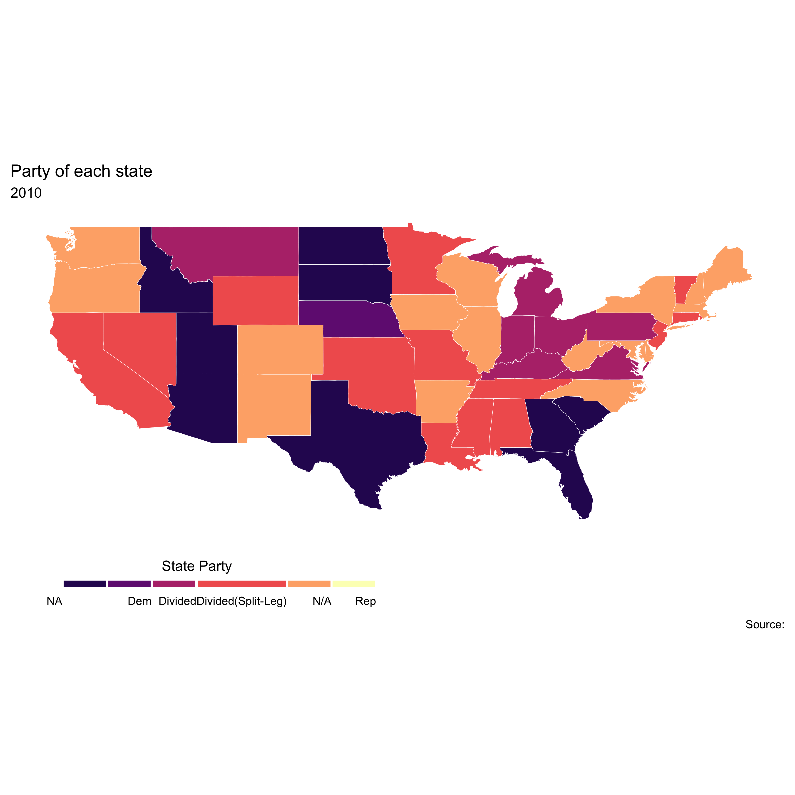

<style type="text/css">

body, td {
   font-size: 16px;
}
code.r{
  font-size: 20px;
}
pre {
  font-size: 12px
}
</style>


## 1. The data I currently have:

#### 1.1 State and Legislative Partisan Composition from 2010 to 2020. Collected from NCSL. 

The code for extraction table from a pdf can be found here:

```
install.packages("rJava", type = "source")
install.packages("tabulizer")
install.packages("tidyverse")
install.packages(rJava)
library(rJava)
library(pdftools)
library(tidyverse)
library(plyr)
library(data.table)
library(tabulizer)
library(tidyverse)

# Automatically open the file and select the area you want to transfer to table
out = extract_areas("~/Desktop/Split/2010.pdf", 1) # the numebr is the page
table = data.frame(out)
table
fwrite(table, file="2010.csv", append = FALSE)
```

The description of the two tables:

* "Divided_Government_ByYear.xlsx": 
    Variables: STATE, LegisControl, GovParty, StateControl
    Year: 2010-2020
    
* "StateControl.csv":
    Variables: State, year
    
    **Legislative Control** When the same party holds both chambers, that party has legislative control. When the chambers are held by different parties, it is divided. Nebraska is not included.
    
    **State Control** When the same party holds both legislative chambers and the governorship, that party has state control. When any of those three points of power is held by another party, state control is divided. This is based on the number of members of each party and does not take into account coalitions that might change effective control. Nebraska is not included.
    
"Split" level under the variable of "LegisControl" is the split-legislature, I marked the divided government of states with split-legislature in the legislature as Divided(Split-Leg)**


#### 1.2 ASPEP local payroll: not much useful


#### 1.3 State and Local Government Spending in the United States - Education

Resourece: https://www.usgovernmentspending.com/compare_state_spending_20p


## 2. Reference

Alt and Lowry show that divided government are less responsive to actual revenue shocks. 

         Reference: Divided Government, Fiscal Institutions, and Budget Deficits: Evidence from the States; James E. Alt and Robert C. Lowry
         
         
## 3. Mission

I want to explore that if the different partisan composition of state have an impact on the local educational outcome. To consider the educational outcome, the data should be collected from a wide range from the resources. 

```{r results = 'hide', include = F}
library(gridExtra)
library(dplyr)
library(GGally)
library(maps)
library(magick)
library(magrittr)
library(ggplot2)
library(tidyverse)
library(mapproj)
library(grid)
library(Rmisc)
library(plotly)
library(gapminder)
library(gganimate)
library(highcharter)
library(formattable)
library(DT)
library(plyr)
library(data.table)
library(magrittr)
library(readxl)
library(haven)
library(glue)
library(janitor)
library(tidyverse)
library(ggfortify)
library(expss)
library(xtable)
library(psycho)
library(devtools)
library(gif)
library(gt)
library(kableExtra)
library(htmlTable)
library(magrittr)
library(purrr)
library(repurrrsive)
library(shiny)
library(xts)
library(sf)
library(tidyr)
library(raster)
library(spData)
library(leaflet)
library(gifski)
library(maps)
library(ggthemes)
library(ggfortify)
library(magick)
library(viridis)
library(animation)
library(caTools)
library(imager)
library(png)
```

```{r}
gov_com <- read.csv("StateControl.csv",header=T)
Var <- c("State","2010","2011","2012","2013","2014","2015","2016","2017","2018","2019","2020")
colnames(gov_com) <- Var
year <- c(2:12)
gov_com[,year] <- lapply(gov_com[,year],factor)
gov_com <- gov_com[-c(51:53),]
```


Plot the state of state partisan map from 2010 to 2020 


```{r results = 'hide'}
# us_states <- map_data("state")
# gov_com$region <- tolower(gov_com$State)
# gov_com_region <- left_join(us_states, gov_com)

```

```{r}
# scale <- levels(gov_com_region[,8])
# labels_scale <- rev(scale)
# 
# 
# plot_state_composite = function (data, column) {
#   ggplot() +
#     geom_polygon(data = data, aes(fill = data[,column], 
#                                   x = long, 
#                                   y = lat, 
#                                   group = group)) +
#     geom_path(data = data, aes(x = long, 
#                                y = lat, 
#                                group = group), 
#               color = "white", size = 0.1) +
#     coord_equal() +
#     theme_map() +
#     theme(legend.position = "bottom") +
#     labs(x = NULL, 
#          y = NULL, 
#          title = "Party of each state", 
#          subtitle = colnames(data[column]), 
#          caption = "Source: ",
#          size = 0.5) +
#     scale_fill_manual(
#       values = rev(magma(7)),
#       name = "State Party",
#       drop = FALSE,
#       labels = labels_scale,
#       guide = guide_legend(
#         direction = "horizontal",
#         keyheight = unit(2, units = "mm"),
#         keywidth = unit(10 / length(labels), units = "mm"),
#         title.position = 'top',
#         title.hjust = 0.5,
#         label.hjust = 1,
#         label.vjust = 0.5,
#         nrow = 1,
#         byrow = T,
#         # also the guide needs to be reversed
#         reverse = T,
#         label.position = "bottom"
#       )
#     ) 
# }
#  myplots <- lapply(colnames(gov_com_region)[8:ncol(gov_com_region)], plot_state_composite, data = gov_com_region)
```


```
for(i in 1:11){
  ggsave(filename=paste("p_", i, ".png"), plot=myplots[[i]], device="png",
       dpi=500)
}

list.files(pattern = '*.png', full.names = TRUE) %>% 
        image_read() %>% # reads each path file
        image_join() %>% # joins image
        image_animate(fps=4) %>% # animates, can opt for number of loops
        image_write("FileName.gif") # write to current dir
```


```
obs_in_env <- ls()
ggplots_in_env_lgl <- map_lgl(
   obs_in_env,
  ~ is.ggplot(get(.))
 )
ggplots_in_env_lgl
ggplots_in_env <- obs_in_env[ggplots_in_env_lgl] %>% sort()

animation::saveGIF(
  expr = {
    purrr::walk(
      ggplots_in_env,
      ~ plot(get(.))
    )
  },
  movie.name = "filename.gif",
  loop = TRUE
  ani.width = 910,
  ani.height = 800
)
```




A look into the data we need:


```{r results = 'hide'}
gov_com <- gov_com[,-13]
```

"A general difficulty in educational data is to find a good measure to express the share of children that are taken into, enrolled, or attending educational institutions." 

```{r results = 'hide'}
edu_2010 <- read.csv("usgs_state_2010.csv");edu_2011 <- read.csv("usgs_state_2011.csv");edu_2012 <- read.csv("usgs_state_2012.csv")
edu_2013 <- read.csv("usgs_state_2013.csv");edu_2014 <- read.csv("usgs_state_2014.csv");edu_2015 <- read.csv("usgs_state_2015.csv")
edu_2016 <- read.csv("usgs_state_2016.csv");edu_2017 <- read.csv("usgs_state_2017.csv");edu_2018 <- read.csv("usgs_state_2018.csv")
edu_2019 <- read.csv("usgs_state_2019.csv");edu_2020 <- read.csv("usgs_state_2020.csv")
col_name <- c("State","state_spending","local_spending","StateAndLocalSpending")
```

```{r results = 'hide', include = F}
clean_edu_data = function(data){
    setnames(data, c(2), c("state_spending"))
    newdata <- data[-c(which(is.na(as.numeric(data$state_spending)))),]
    for(i in 2:ncol(newdata)){
    newdata[,i] <- as.numeric(newdata[,i])
    }
    newdata <- newdata[,which(unlist(lapply(newdata, function(x) !all(is.na(x)))))]
    return(newdata)
}

new_2010 <- clean_edu_data(edu_2010)[,c(1:4)];new_2011 <- clean_edu_data(edu_2011)[,c(1:4)];new_2012 <- clean_edu_data(edu_2012)[,c(1:4)]
new_2013 <- clean_edu_data(edu_2013)[,c(1:4)];new_2014 <- clean_edu_data(edu_2014)[,c(1:4)];new_2015 <- clean_edu_data(edu_2015)[,c(1:4)]
new_2016 <- clean_edu_data(edu_2016)[,c(1:4)];new_2017 <- clean_edu_data(edu_2017)[,c(1:4)];new_2018 <- clean_edu_data(edu_2018)[,c(1:4)]
new_2019 <- clean_edu_data(edu_2019)[,c(1:4)];new_2020 <- clean_edu_data(edu_2020)[,c(1:4)]

data.table::setnames(new_2010,col_name);data.table::setnames(new_2011,col_name);data.table::setnames(new_2012,col_name);setnames(new_2013,col_name)
data.table::setnames(new_2014,col_name);data.table::setnames(new_2015,col_name);data.table::setnames(new_2016,col_name);setnames(new_2017,col_name)
data.table::setnames(new_2018,col_name);data.table::setnames(new_2019,col_name);data.table::setnames(new_2020,col_name)

new_2010<-subset(new_2010, State!="All states combined" & State!="District of Columbia")
new_2011<-subset(new_2011, State!="All states combined" & State!="District of Columbia")
new_2012<-subset(new_2012, State!="All states combined" & State!="District of Columbia")
new_2013<-subset(new_2013, State!="All states combined" & State!="District of Columbia")
new_2014<-subset(new_2014, State!="All states combined" & State!="District of Columbia")
new_2015<-subset(new_2015, State!="All states combined" & State!="District of Columbia")
new_2016<-subset(new_2016, State!="All states combined" & State!="District of Columbia")
new_2017<-subset(new_2017, State!="All states combined" & State!="District of Columbia")
new_2018<-subset(new_2018, State!="All states combined" & State!="District of Columbia")
new_2019<-subset(new_2019, State!="All states combined" & State!="District of Columbia")
new_2020<-subset(new_2020, State!="All states combined" & State!="District of Columbia")
```


Now we have two datasets: 
   new_YYYY
   gov_com

Build up time-series dataset:

<br>


```{r}
time_2010 <- t(new_2010[,4]);time_2011 <- t(new_2011[,4]);time_2012 <- t(new_2012[,4]);time_2013 <- t(new_2013[,4])
time_2014 <- t(new_2014[,4]);time_2015 <- t(new_2015[,4]);time_2016 <- t(new_2016[,4]);time_2017 <- t(new_2017[,4])
time_2018 <- t(new_2018[,4]);time_2019 <- t(new_2019[,4]);time_2020 <- t(new_2020[,4])
ts_edu_spending <- rbind(time_2010,time_2011,time_2012,time_2013,time_2014,time_2015,time_2016,time_2017,
                         time_2018,time_2019,time_2020)
ts_edu_spending <- data.table(ts_edu_spending)
state_name <- c(t(new_2010[,1]))
setnames(ts_edu_spending,state_name)
year <- c(2010:2020)
ts_edu_spending <- cbind(year,ts_edu_spending)
ts_gov_com <- data.table(t(gov_com))
names(ts_gov_com) <- ts_gov_com %>% slice(1) %>% unlist()
ts_gov_com <- ts_gov_com %>% slice(-1)
ts_gov_com <- cbind(year,ts_gov_com)
kable(cbind(ts_gov_com), "html",caption = "State-level partisan composite") %>%
    kable_styling() %>%
    scroll_box(width = "910px", height = "400px") 
kable(cbind(ts_edu_spending), "html",caption = "Education spending of each state") %>%
    kable_styling() %>%
    scroll_box(width = "910px", height = "400px")
``` 


```{r}
xts_edu_spending <- ts_edu_spending %>% remove_rownames %>% column_to_rownames(var="year")

xts_edu_spending <- xts(xts_edu_spending, order.by=as.Date(rownames(xts_edu_spending),"%Y"))

highchart(type = "stock")  %>% 
hc_add_series(name = "Alabama",xts_edu_spending$Alabama) %>% 
hc_add_series(name = "Arizona",xts_edu_spending$Arizona) %>% 
hc_add_series(name = "Florida",xts_edu_spending$Florida) %>% 
hc_add_series(name = "Georgia",xts_edu_spending$Georgia) %>%
       hc_title(text = "Republican Alabama/Arizona/Florida/Georgia")
```


```{r}
highchart(type = "stock")  %>% 
hc_add_series(name = "California",xts_edu_spending$California) %>% 
hc_add_series(name = "Hawaii",xts_edu_spending$Hawaii) %>% 
hc_add_series(name = "Delaware",xts_edu_spending$Delaware) %>% 
hc_add_series(name = "Washington",xts_edu_spending$Washington) %>%
       hc_title(text = "Democratic California/Hawaii/Connecticut/Vermont")

```

```{r, incldue = F}
library(reshape2)
library(corrplot)
library(corrr)
```

```{r}
rep <- cbind(xts_edu_spending$Alabama,xts_edu_spending$Arizona,
             xts_edu_spending$Florida,xts_edu_spending$Georgia)
dem <- cbind(xts_edu_spending$California,xts_edu_spending$Delaware,
             xts_edu_spending$Hawaii,xts_edu_spending$Washington)

cor_dec <- ts_edu_spending[,-1]
corr_simple <- function(data=df,sig=0.8){
  #convert data to numeric in order to run correlations
  #convert to factor first to keep the integrity of the data - each value will become a number rather than turn into NA
  df_cor <- data %>% mutate_if(is.character, as.factor)
  df_cor <- df_cor %>% mutate_if(is.factor, as.numeric)  #run a correlation and drop the insignificant ones
  corr <- cor(df_cor)
  #prepare to drop duplicates and correlations of 1     
  corr[lower.tri(corr,diag=TRUE)] <- NA 
  #drop perfect correlations
  corr[corr == 1] <- NA   #turn into a 3-column table
  corr <- as.data.frame(as.table(corr))
  #remove the NA values from above 
  corr <- na.omit(corr)   #select significant values  
  corr <- subset(corr, abs(Freq) > sig) 
  #sort by highest correlation
  corr <- corr[order(-abs(corr$Freq)),]   #print table
  print(corr)  #turn corr back into matrix in order to plot with corrplot
  #mtx_corr <- reshape2::acast(corr, Var1~Var2, value.var="Freq")
  
  #plot correlations visually
  #corrplot(mtx_corr, is.corr=FALSE, tl.col="black", na.label=" ")
}
#corr_simple(cor_dec)

cor_dec %>% correlate() %>% network_plot(min_cor=0.8, colors = c("red", "green","blue","yellow"), legend = TRUE)
```


<br>


**The correlation matrix of education spending of four states of democratic(left) and The correlation matrix of education spending of four states of republican(right)**

```{r}
plot_rep <- ggcorr(rep, geom = "blank", label = TRUE, hjust = 0.75,label_round = 3) +
  geom_point(size = 20, aes(color = coefficient > 0, alpha = abs(coefficient) > 0.5)) +
  scale_alpha_manual(values = c("TRUE" = 0.5, "FALSE" = 0)) +
  guides(color = FALSE, alpha = FALSE)

plot_dem <- ggcorr(dem, geom = "blank", label = TRUE, hjust = 0.75,label_round = 3) +
  geom_point(size = 20, aes(color = coefficient > 0, alpha = abs(coefficient) > 0.5)) +
  scale_alpha_manual(values = c("TRUE" = 0.5, "FALSE" = 0)) +
  guides(color = FALSE, alpha = FALSE)

 grid.arrange(plot_dem, plot_rep, ncol=2)
```
For the year 2010-2020. I select 4 states of democratic(Alabama, 10 years; Arizona, 11 years; Florida, 11 years; Georgia, 11years) and select 4 states of republican(California, 11 years; Delaware, 11 years; Hawaii, 10 years; Washington, 9 years). "year" means how many years of controled by selected party during 11 years. The figure shows the correlation matrix of their spending over the 11 years. It is appearant that the correlation of the spending for republican is very high, in contrast, the correlation of 4 democratic states is low, except the correlation between Washington and California.

Continue here


